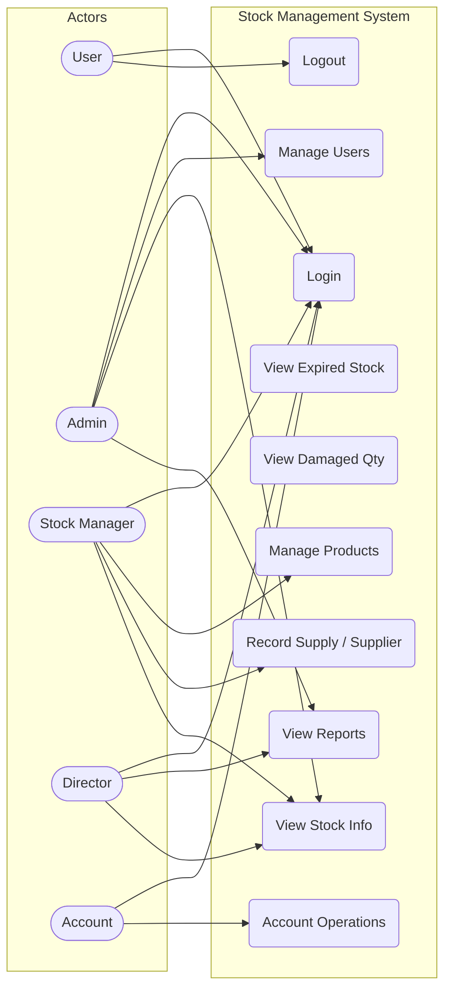
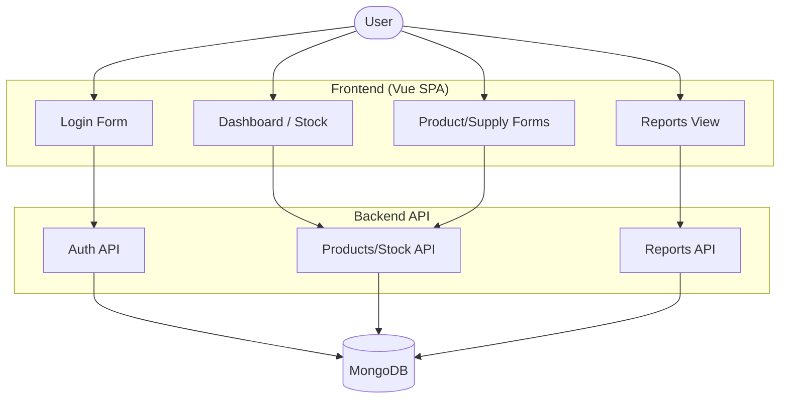
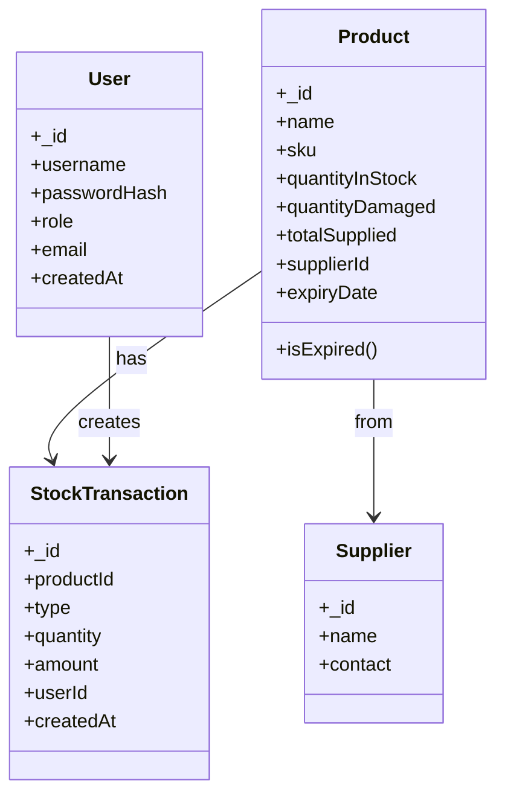
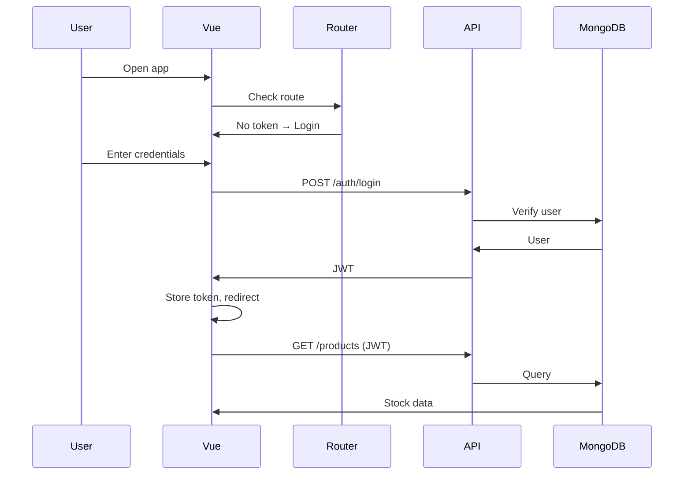

# Stock Management System — Diagrams Reference

This file contains the same diagrams as in `SYSTEM_OVERVIEW.md`, for quick reference and rendering in diagram tools.

## Use Case Diagram (Mermaid)

## Data Flow Diagram — Level 1

## Class Diagram

## Login + View Stock Sequence

