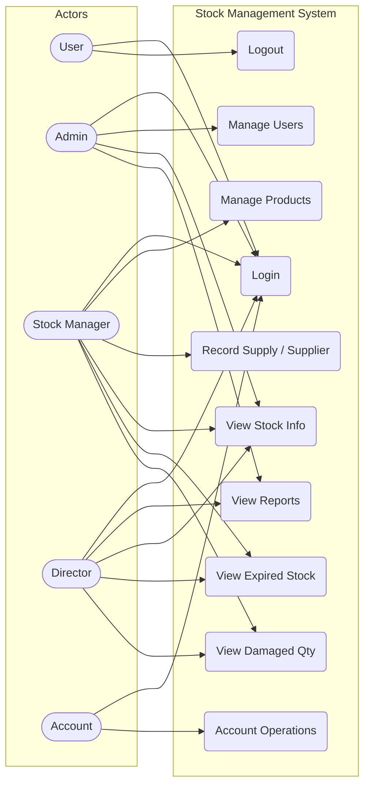
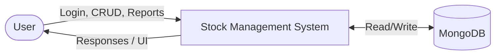
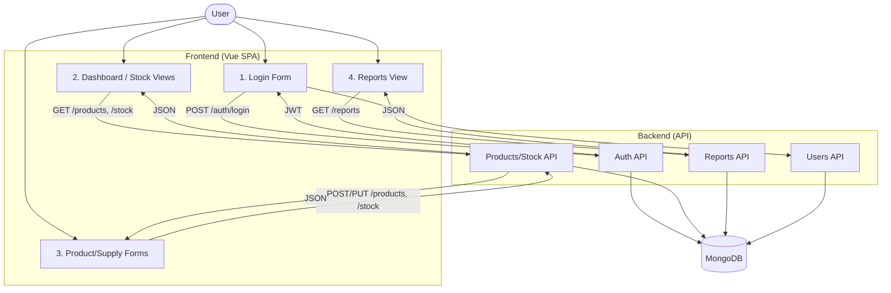
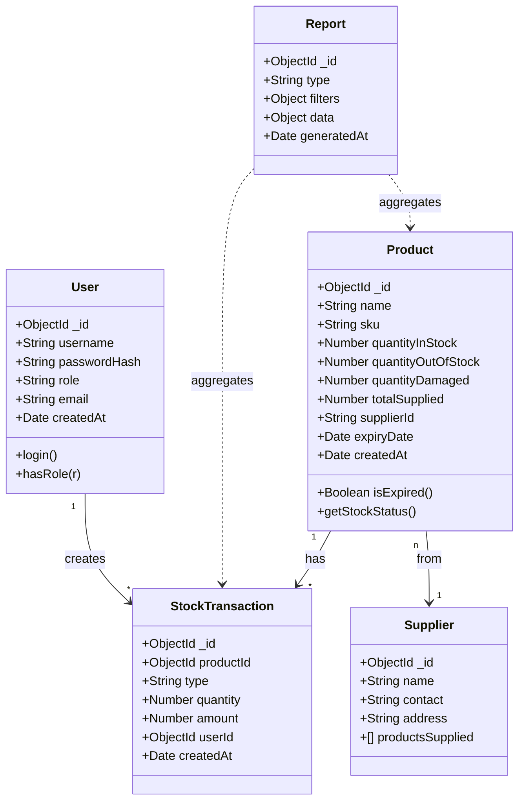
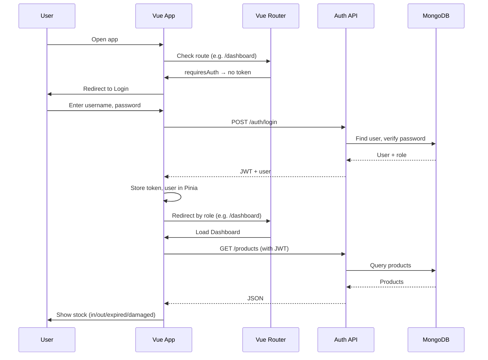
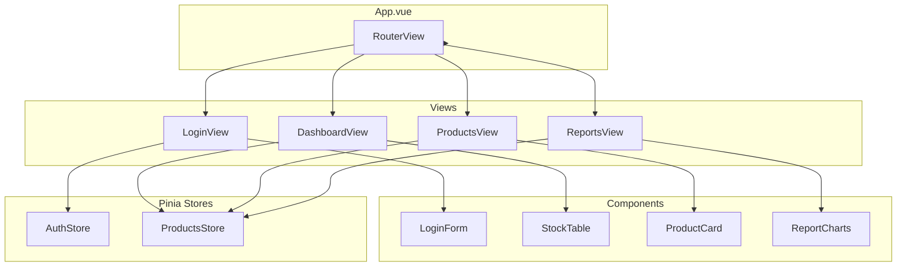

# Stock Management Control System — System Overview

## 1. Purpose

The **Stock Management Control System** is a web application that lets authorized users view and manage stock information: **expired stock**, **in stock**, **out of stock**, **damaged quantity**, and related data. Users log in by role (**Account**, **Stock Manager**, **Admin**, **Director**) and perform role-specific actions.

---

## 2. How the System Works (Software Engineer View)

### 2.1 High-Level Flow

1. **User visits the app** → Single Page Application (SPA) loads (`index.html` + Vue app).
2. **Login** → User enters credentials; backend validates and returns a token (e.g. JWT); frontend stores it and redirects by role.
3. **Role-based access** → Router and API enforce:
   - **Account** – account-related operations.
   - **Stock Manager** – manage products, stock levels, suppliers, receive stock.
   - **Admin** – full access, user management, system settings.
   - **Director** – view reports and dashboards only.
4. **Stock data** → Products are stored with: name, SKU, quantities (in stock, out of stock, damaged), expiry, **supplier/source**, and **total supplied amount**. Time and accounting logic (e.g. cost, totals) are applied when recording or reporting.
5. **Reports** → Director (and optionally others) view dashboards/reports built from the same data (expired, in/out stock, damaged, supplier totals).

### 2.2 Key Technical Concepts (aligned with Task-Buddy / Web Tech)

| Concept | Meaning in this system |
|--------|-------------------------|
| **SPA** | One HTML entry; Vue Router changes views without full page reload. |
| **Components** | Reusable UI (e.g. `ProductCard`, `StockTable`, `LoginForm`) with props down, emit up. |
| **State (Pinia)** | Global state for user, products, stock filters so multiple views stay in sync. |
| **Routing & Guards** | Routes like `/dashboard`, `/reports`; guards check auth and role before allowing access. |
| **Async/Await** | All API calls (login, CRUD, reports) are async; UI waits for backend then updates. |

---

## 3. User Roles Summary

| Role | Main capabilities |
|------|-------------------|
| **Account** | Account operations (profile, own data). |
| **Stock Manager** | Add/edit products, record stock in/out/damaged, link supplier and total supplied. |
| **Admin** | Full access; user management; default login: `eddyprince` / `123`. |
| **Director** | View reports and dashboards (expired, in stock, out of stock, damaged, etc.). |

---

## 4. Diagrams (Mermaid)

The following diagrams are in Mermaid format. They can be viewed in GitHub, VS Code (with a Mermaid extension), or any Mermaid-compatible viewer.

### 4.1 Use Case Diagram

**Use case summary:**

- **Login / Logout** – All authenticated roles.
- **View Stock Info** – In stock, out of stock, expired, damaged (role-dependent views).
- **View Expired Stock / View Damaged Qty** – Part of stock info; Director and Stock Manager (and Admin).
- **Manage Products** – Stock Manager, Admin (add/edit products, set supplier and total supplied).
- **Record Supply / Supplier** – When putting product in system: record where it’s from and total supplied (Stock Manager, Admin).
- **View Reports** – Director, Admin.
- **Manage Users** – Admin only.
- **Account Operations** – Account role (profile, etc.).

---

### 4.2 Data Flow Diagram (Level 0 – Context)

### 4.2b Data Flow Diagram (Level 1 – Main Processes)

**Data flows:**

- **Login**: User → Login Form → Auth API → MongoDB (verify user); Auth API → JWT → Frontend (store token).
- **Stock/Products**: User → Dashboard or Forms → Products/Stock API → MongoDB; API returns JSON to frontend.
- **Reports**: User → Reports View → Reports API → MongoDB (aggregations); API returns report data.
- **Users**: Admin → User management → Users API → MongoDB.

---

### 4.3 Class Diagram (Domain / Data Model)

**Explanation:**

- **User**: Credentials and role; used for auth and to associate actions (e.g. StockTransaction).
- **Product**: Core entity; holds in/out/damaged quantities, **totalSupplied**, **supplierId** (where it’s from), expiry; derived helpers like `isExpired()`, `getStockStatus()` support UI and reports.
- **Supplier**: Source of products; referenced by Product.
- **StockTransaction**: Each “movement” (in/out/damaged) with quantity, optional amount (accounting), user, time — used for history and reporting.
- **Report**: Generated report type, filters, and payload (aggregated from Product and StockTransaction).

---

### 4.4 Sequence Diagram — Login and View Stock

---

### 4.5 Component Architecture (Vue – High Level)

---

## 5. Security and Logic Notes

- **Login and account creation**: Implemented in backend (e.g. register, login); passwords hashed (e.g. bcrypt); JWT for session.
- **Time logic**: Expiry and “expired” status computed from `expiryDate` vs current date; timestamps on transactions for reporting.
- **Accounting logic**: Total supplied amount and optional cost/amount per transaction stored in Product and StockTransaction; reports aggregate as needed.
- **Product “where it is from”**: Stored as `supplierId` (and optionally supplier name); when putting product in system, form captures supplier and total supplied amount and saves to Product (and optionally StockTransaction).

---

## 6. Default Admin Credentials

- **Username:** `eddyprince`  
- **Password:** `123`  

(To be created on first run or via seed; in production use strong password and change immediately.)

---

This document and the diagrams above describe how the system works from a software engineering perspective and should be used together with the actual codebase (frontend and backend) and the Task-Buddy material for implementation details (SPA, components, state, routing, async/await).
